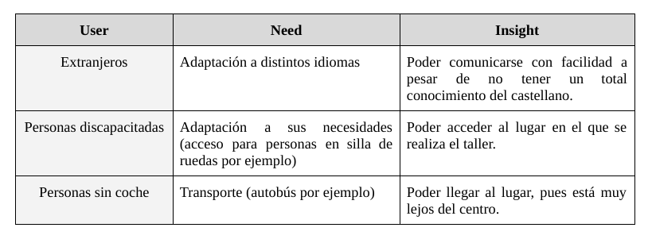
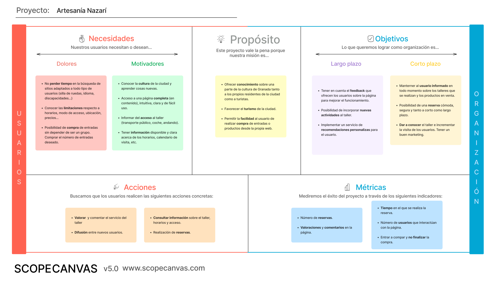
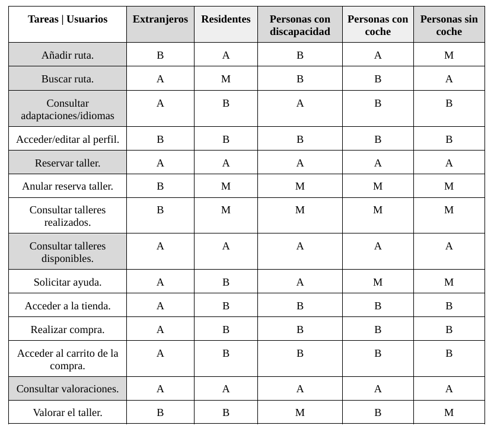
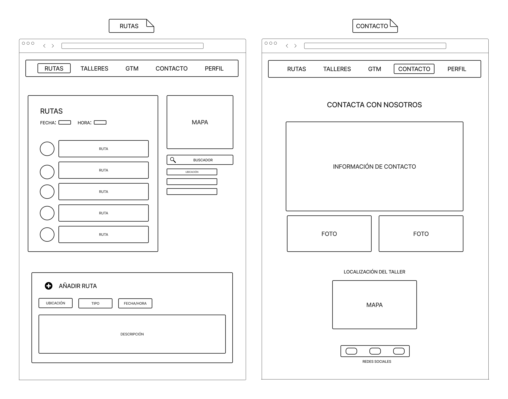

# DIU23
Prácticas Diseño Interfaces de Usuario 2022-23 (Tema: Turismo ) 

**Grupo:** DIU3_GatosUniversitarios 
**Updated:** 12/05/2023

> **Proyecto** - Granada en tus manos.

> **Descripción** - Aplicación de un taller de Arte Nazarí en Granada que ofrece una amplia variedad de talleres con diferentes niveles de dificultad.

### Logotipo

### Miembros
 * 	:smile_cat:   Mario Martínez Sánchez       
 * 	:smile_cat:  Teresa Fernanda Reyes García

----- 

# Proceso de Diseño 

## Paso 1. UX Desk Research & Analisis 

 1.a Empathy Map
-----

Después de completar el mapa de empatía, hemos concluido que los usuarios acceden a la página web en busca de información relevante sobre el taller, como el precio, duración del mismo o adaptaciones a diferentes tipos de usuarios (silla de ruedas, idioma…). 

Sin embargo, la apariencia y la navegación deficientes de la página dificultan la búsqueda de información, lo que resulta en una experiencia de usuario poco satisfactoria. Por lo tanto, recomendamos mejorar la página mediante la creación de una interfaz más intuitiva y visual, lo que permitirá un acceso más fácil a la información y, en consecuencia, conseguir una experiencia de usuario más positiva y útil.

 1.b Competitive Analysis
-----

Para la realización del análisis de competencia, hemos buscado distintas páginas relacionadas con la temática de la práctica, es decir, páginas en las que se ofrecieran talleres, tours y visitas por Granada. Entre las encontradas, optamos por quedarnos con las dos siguientes:

> [**La Alborea**](https://alboreaflamenco.com/) --> En esta página, podemos encontrar espectáculos de flamenco a buen precio y con una página con buenas calidades (tanto de foto como de video), pero con un diseño y una visualización muy mejorable, pues la página es muy oscura (predominando el negro y el rojo). 

> [**Cicerone**](https://acortar.link/WpaoG1) --> En esta web encontramos visitas por Granada, aunque a un precio excesivamente elevado. Tiene un diseño simple pero eficaz, estando muy bien organizada y con un buen manejo y cantidad de información.

> [**Artesanía Nazarí**](https://artesanianazari.es/inicio/?lang=es) --> Esta es la página propuesta en la práctica, la cuál tiene un diseño poco agradable y un manejo complicado, lo que la hace poco útil e intuitiva. Además, a pesar de ser completa, pues tiene mucha información, el mal reparto de esta provoca la insatisfacción del usuario, pues es difícil encontrar la información solicitada.

De esta forma, rellenamos la tabla de comparativas de la siguiente manera:

En conclusión, en el caso de tener que escoger una de las opciones, escogeremos Cicerone, pues es la única que es tanto completa como intuitiva, además de tener un buen diseño, facilitando el uso de esta al usuario y, de este modo, garantizando una buena experiencia.

 1.c Persona
-----

Hemos querido crear personas con personalidades diferentes pero que tengan en común las ganas de descubrir cosas nuevas, para demostrar cómo un sitio web de taller nazarí puede ser visitado por usuarios muy diferentes. Son personas curiosas, con ganas de aprender y que buscan planes innovadores que estén adaptados a sus necesidades y requerimientos personales.

### Persona 1 : Juan Alberto

Hemos seleccionado a Juan Alberto por:

- Está muy acostumbrado a las nuevas tecnologías.
- Necesita que los sitios que visita estén adaptados a su silla de ruedas.
- Al tener grandes conocimientos, puede ser un usuario muy exigente. Necesita una web de fácil acceso, intuitiva y llamativa.

### Persona 2 : Isabelina

Hemos seleccionado a Isabelina por:

- No está muy acostumbrada a las nuevas tecnologías, se defiende.
- Es muy perfeccionista y no tiene mucho tiempo libre, necesita que sus planes se adapten a su horario.
- Necesita una web clara y de fácil uso.

 1.d User Journey Map
----

### Descripción.

Hemos querido describir dos experiencias diferentes de usuarios al navegar por una misma web. La primera experiencia es la de Juan Alberto, quien se emociona al encontrar el sitio web del taller, pero se siente frustrado al ver el mal diseño y distribución de la página. Además, al intentar comprar entradas para él y su pareja, se da cuenta de que no hay una opción para comprar solo dos entradas, la web es poco accesible para personas en silla de ruedas y el precio es elevado. Esto lo lleva a replantearse su decisión de asistir al taller. Por otro lado, Isabelina tiene una experiencia más fluida, aunque también enfrenta dificultades para encontrar información relevante en la web, pero finalmente logra comprar las entradas y disfrutar del taller con sus amigos. 

Consideramos que ambas experiencias podrían ser una experiencia habitual de un usuario en la web, buscando que esta se adapte a sus necesidades y requerimientos.

### Journey Map : Juan Alberto

Para la ‘Propuesta de Valor’, hemos completado un LeanUXCanvas, el cual contiene información sobre los objetivos y propósitos en los que nos centraremos, en función de las necesidades y acciones más frecuentes de los usuarios.

### Journey Map : Isabelina

 1.e Usability Review
----

Los enlaces al Usability Review son:

-	:scroll: [Usability_Review.xlsx](P1/Usability-review-Artesanía_Nazarí.xlsx)

-	:scroll: [Usability_Review.pdf](P1/Usability-review-Artesanía_Nazarí.pdf)

### Valoración y conclusión:

:trophy: **Valoración final (numérica):** 67 - Moderate

La página web es una web funcional en cuanto a que cumple los objetivos básicos de los usuarios, lo cual es importante. Sin embargo, su falta de intuitividad y claridad podría dificultar la experiencia del usuario al navegar por la página. Tiene un diseño oscuro y triste, esto podría afectar negativamente a la percepción del usuario y hacer que se sienta menos atraído por la página. Esta web podría mejorarse en varios aspectos.

A pesar de lo mencionado anteriormente, la página web cuenta con muchas características que le convierten en una web aceptable y útil:

- Es una web responsive, tiene una buena visualización aunque su diseño es mejorable.
- Dispone de mucha información útil para el usuario: descripción del taller, materiales, maestros, galería de fotos... 
- El menú de navegación es muy completo y muy visual.
- Cuenta con muchos idiomas diferentes, adaptándose a posibles usuarios extranjeros.

## Paso 2. UX Design  

 2.a Feedback Capture Grid / POV
----
Para la sección de Ideación hemos realizado una ‘Malla receptora de información’ y una tabla con los ‘Point of View’ de distintos usuarios. Hemos escogido dichos diagramas porque pensamos que son los que mejor pueden adaptarse a nuestra propuesta y mostrarla de una forma visual.

### FeedBack Capture Grid

    
### POV : Point Of View

 2.b Propuesta de Valor
----

Nosotros tenemos como objetivo hacer que el acceso a nuestro taller sea fácil y accesible para todos los visitantes, sin importar sus necesidades o circunstancias. Queremos diseñado una propuesta de valor pensando en los diferentes perfiles de nuestros visitantes, desde extranjeros hasta personas con discapacidad, y ofrecemos una variedad de opciones para garantizar una experiencia personalizada y cómoda para todos.

Lo que más destaca de nuestra propuesta es que nos hemos centrado en el acceso al taller de una forma más amena, con la posibilidad de ir en compañía. Además, queremos mostrar que tanto el acceso al taller como el contenido de este, puede adaptarse a todo tipo de usuarios sin importar su condición física, el idioma en el que hable, etc. 

### Scope Canvas

Para la Propuesta de Valor, hemos completado un LeanUXCanvas, el cual contiene información sobre los objetivos y propósitos en los que nos centraremos, en función de las necesidades y acciones más frecuentes de los usuarios.

 2.c Tasks analysis 
-----

Para el ‘Análisis de Tareas’ hemos realizado una matriz de tareas/usuarios, el cual hemos centrado en la posibilidad de añadir rutas para acceder al taller, ya sea en coche, andando o de cualquier otra forma. De esta forma, los clientes podrán llegar al lugar del taller con compañía y de forma más amena. También le hemos dado una gran importancia a las personas con dificultades, ya sea por discapacidad, desconocimiento del idioma, etc.

 2.d IA: Sitemap + Labelling 
----

En este paso, hemos propuesto una organización lógica para la navegación y los elementos de diseño de la página web. Hemos creado un mapa del sitio (sitemap) donde mostramos la arquitectura que va a seguir nuestra aplicación.

En la siguiente tabla se recogen los términos empleados y la funcionalidad de los mismos.

 

 2.e Wireframes
-----

En esta última sección hemos creado unos bocetos de las distintas pantallas del interfaz, que nos van a mostrar visualmente el funcionamiento de la aplicación. Para la realización de los mismos hemos hecho uso de la herramienta Figma.

### Inicio, Sobre nosotros y Perfil del usuario

### Talleres generales y un taller en concreto

### Rutas y Contacto

## Paso 3. Mi UX-Case Study (diseño)

 3.a Moodboard
-----

Para la realización del Moodboard, hemos utilizado [**Figma**](https://www.figma.com/). Con esto, hemos querido transmitir la idea principal de nuestra página: aportar la posibilidad de crear arte a partir de barro. Para ello, hemos mostrado tanto los colores que predominarán en la página, como la tipografía, el logotipo y algunas imágenes inspiradoras.

### Moodboard

### Logotipos

Hemos diseñado nuestro logotipo haciendo uso de [**Canva**](https://www.canva.com/). Nos resulta una herramienta muy sencilla para este tipo de diseños. Contestando a la pregunta que se plantea, estos logos no podrían usarse como banner para una red social directamente, sino que habría que adaptar su tamaño y/o apariencia.

  3.b Landing Page
----

Para el diseño de la Landing Page hemos hecho uso de [**Canva**](https://www.canva.com/). En ella, mostramos al público qué queremos ofrecer y cómo lo ofreceremos. Para ello, utilizamos un título que describe qué ofrece la página, junto con una pequeña descripción cuyo objetivo es captar la atención del receptor. Además, mostramos los puntos fuertes de nuestros talleres e imágenes que representan los trabajos realizados en estos.

Hemos realizado dos versiones, para mostar cómo se vería tanto en web como en móvil.

### Versión web

### Versión móvil

 3.c Guidelines
----

### Guía de estilo

Para la realización de la práctica, hemos utilizado [**Canva**](https://www.canva.com/), pues es la aplicación que mejor controlamos y, a su vez, contaba con funciones muy útiles y visuales para el diseño de la página.

### Paleta de colores

Respecto a los colores, hemos utilizado la herramienta [**Coolors**](https://coolors.co/). Hemos realizado una paleta de colores con distintos marrones, simulando el barro y la tierra, pues es el material principal en nuestros talleres. De esta forma, está dividida de colores más oscuros a colores más claros.

### Tipografía 

Para escribir texto, hemos utilizado distintos tipos de tipografía, cuyo objetivo es llamar la atención del cliente, siendo fácil de leer y profesional a la vez. La tipografía seleccionada ha sido la siguiente:

> - **The Seasons**: destaca por su aportación en el logotipo. Salvo esto, no se utiliza en muchos más casos (algunas secciones de texto como el nivel de los talleres).

> - **Roboto**: esta es la tipografía principal, pues es la más utilizada (exceptuando títulos, subtítulos, logotipos, etc). También la hemos utilizado para las distintas secciones del menú.

> - **Bebas Neue**: es la tipografía más utilizada para títulos y subtítulos, pues es perfecta para captar la atención del usuario.

  3.d Mockup
----

Para esta sección, al igual que para el Landing Page, hemos realizado dos diseños en [**Canva**](https://www.canva.com/) (uno para web y otro para móvil). Para esto hemos seguido los bocetos Low-Fi, realizados en la práctica anterior, utilizando los colores y la tipografía especificada en el Guidelines. Además, hemos puesto botones, de forma que se pueda interactuar con el menú, accediendo a todas las opciones implementadas.

Una vez descargados los pdfs de los prototipos, se puede simular la navegación de la web mediante el menú de navegación y otros botones.

### Versión web

-	:scroll: [Prototipo HI-FI Web](P3/LayoutHI-FI/Prototipo(Web).pdf)

### Versión móvil

-	:scroll: [Prototipo HI-FI Web](P3/LayoutHI-FI/Prototipo(Phone).pdf)

### Ejemplos de la versión web

 3.e ¿My UX-Case Study?
-----

>>> Publicar my Case Study en Github..
>>> Documente y resuma el diseño de su producto en forma de video de 90 segundos aprox

## Paso 4. Evaluación 

 4.a Caso asignado
----

>>> Breve descripción del caso asignado con enlace a  su repositorio Github

 4.b User Testing
----

>>> Seleccione 4 personas ficticias. Exprese las ideas de posibles situaciones conflictivas de esa persona en las propuestas evaluadas. Asigne dos a Caso A y 2 al caso B
 

| Usuarios | Sexo/Edad     | Ocupación   |  Exp.TIC    | Personalidad | Plataforma | TestA/B
| ------------- | -------- | ----------- | ----------- | -----------  | ---------- | ----
| User1's name  | H / 18   | Estudiante  | Media       | Introvertido | Web.       | A 
| User2's name  | H / 18   | Estudiante  | Media       | Timido       | Web        | A 
| User3's name  | M / 35   | Abogado     | Baja        | Emocional    | móvil      | B 
| User4's name  | H / 18   | Estudiante  | Media       | Racional     | Web        | B 

. 4.c Cuestionario SUS
----

>>> Usaremos el **Cuestionario SUS** para valorar la satisfacción de cada usuario con el diseño (A/B) realizado. Para ello usamos la [hoja de cálculo](https://github.com/mgea/DIU19/blob/master/Cuestionario%20SUS%20DIU.xlsx) para calcular resultados sigiendo las pautas para usar la escala SUS e interpretar los resultados
http://usabilitygeek.com/how-to-use-the-system-usability-scale-sus-to-evaluate-the-usability-of-your-website/)
Para más información, consultar aquí sobre la [metodología SUS](https://cui.unige.ch/isi/icle-wiki/_media/ipm:test-suschapt.pdf)

>>> Adjuntar captura de imagen con los resultados + Valoración personal 

 4.d Usability Report
----

>> Añadir report de usabilidad para práctica B (la de los compañeros)

>>> Valoración personal 

>>> ## Paso 5. Evaluación de Accesibilidad  (no necesaria)

>>>   5.a Accesibility evaluation Report 
>>>> ----

>>> Indica qué pretendes evaluar (de accesibilidad) sobre qué APP y qué resultados has obtenido 

>>> 5.a) Evaluación de la Accesibilidad (con simuladores o verificación de WACG) 
>>> 5.b) Uso de simuladores de accesibilidad 

>>> (uso de tabla de datos, indicar herramientas usadas) 

>>> 5.c Breve resumen del estudio de accesibilidad (de práctica 1) y puntos fuertes y de mejora de los criterios de accesibilidad de tu diseño propuesto en Práctica 4.

## Conclusión final / Valoración de las prácticas

>>> (90-150 palabras) Opinión del proceso de desarrollo de diseño siguiendo metodología UX y valoración (positiva /negativa) de los resultados obtenidos  

